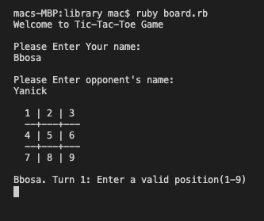
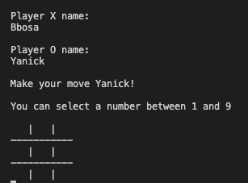

# TIC TAC TOE GAME
Tic-tac-toe (American English), noughts and crosses (Commonwealth English), or Xs and Os is a paper-and-pencil game for two players, X and O, who take turns marking the spaces in a 3×3 grid. The player who succeeds in placing three of their marks in a horizontal, vertical, or diagonal row is the winner.

# Built With
- Ruby
- Rubocop

# Prerequisites
- Browser (Google Chrome, Mozilla Firefox, Safari or any other browser)
- Setup

# Open Terminal

Run git clone https://github.com/t-yanick/oop/tree/milestone_1

Run cd library

Run ruby board.rb

# Game Rules
Each player only can choose one position per turn
You are not allowed to select a position if another player already have a mark there
First player is the 'X'
Second player is the 'O'
Win how complete a line with the same symbol 'X X X' or 'O O O '
If nobody wins after all positions have a symbol it will be a draw Each player only can choose one position per turn

# Game instructions
The player has the option to play or to exit. If the player decides to play, these steps follow:

Player one is the symbol 'X' and player two is the symbol 'O'

A 3x3 grid is displayed on the terminal and the first player chooses a number to place his symbol on that number's position

The players take turns in order to try to make an uninterrupted row, column or diagonal.

The player which does that first wins!

If all spaces are chosen and there is no winner, it is considered a draw

Once the game finish, the players have the option to restart game or exit

# Authors
👤 Bbosa Muhamood

### Bbosa Muhamood
- Github: [@bmuhamood](https://github.com/bmuhamood)
- Twitter: [@croixtechfirm](https://twitter.com/croixtechfirm)
- Linkedin: [Bbosa Muhamood](https://www.linkedin.com/in/bbosa-muhamood-06845576/)

### Tazoh Yanick Tazoh
- Github: [@t-yanick](https://github.com/t-yanick)
- Twitter: [@ElTazoh](https://twitter.com/ElTazoh)
- Linkedin: [Tazoh Yanick](https://linkedin.com/in/tazoh-yanick-5a978764)

🤝 Contributing
Contributions, issues and feature requests are welcome!

Feel free to check the issues page https://github.com/t-yanick/oop/issues.

# Show your support
Give a ⭐️ if you like this project!

### Acknowledgments
- Microverse
- Free Code Camp
- Codecademy
- GitHub
- TheOdinProject
- Ruby

📝 License
This project is MIT licensed.
