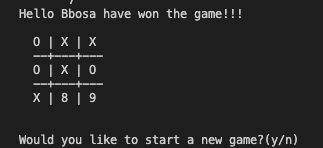

# TIC TAC TOE GAME
In this project, it is assigned for us to create a Tic Tac Toe game using only Ruby to increase our knowledge on the OOP concepts. This project was split in 4 milestones, which were:

 - Setting up the project
 - Designing the user interface
 - Creating the game logic
 - Writing the game instructions
 
 The main goal of this project is to asure I master the methods ruby provides and to learn how to replicate them using basic coding knowledge.

# Built With
- Ruby
- Rubocop
- OOP
- Linters

# Prerequisites
- Browser (Google Chrome, Mozilla Firefox, Safari or any other browser)

# Setup
Open Terminal

Run git clone https://github.com/t-yanick/oop/tree/milestone_1

Run cd lib

Run ruby bin/main

# Game Rules
Each player only can choose one position per turn
You are not allowed to select a position if another player already have a mark there
First player is the 'X'
Second player is the 'O'
Win how complete a line with the same symbol 'X X X' or 'O O O '
If nobody wins after all positions have a symbol it will be a draw Each player only can choose one position per turn

# Game instructions
The player has the option to play or to exit. If the player decides to play, these steps follow:

Player one is the symbol 'X' and player two is the symbol 'O' From the below screen, Players can add thier Names

A 3x3 grid is displayed on the terminal and the first player chooses a number to place his symbol on that number's position

The players take turns in order to try to make an uninterrupted row, column or diagonal.

The player which does that first wins!

If all spaces are chosen and there is no winner, it is considered a draw

Once the game finish, the players have the option to restart game or exit

# Authors
👤 Bbosa Muhamood
- Github: [@bmuhamood](https://github.com/bmuhamood)
- Twitter: [@croixtechfirm](https://twitter.com/croixtechfirm)
- Linkedin: [Bbosa Muhamood](https://www.linkedin.com/in/bbosa-muhamood-06845576/)

👤 Tazoh Yanick Tazoh
- Github: [@t-yanick](https://github.com/t-yanick)
- Twitter: [@ElTazoh](https://twitter.com/ElTazoh)
- Linkedin: [Tazoh Yanick](https://linkedin.com/in/tazoh-yanick-5a978764)

### 🤝 Contributing
Contributions, issues and feature requests are welcome!

Feel free to check the issues page https://github.com/t-yanick/oop/issues.

# Show your support
Give a ⭐️ if you like this project!

### Acknowledgments
- Microverse
- Free Code Camp
- Codecademy
- GitHub
- TheOdinProject
- Ruby

## 📝 License
This project is MIT licensed.
